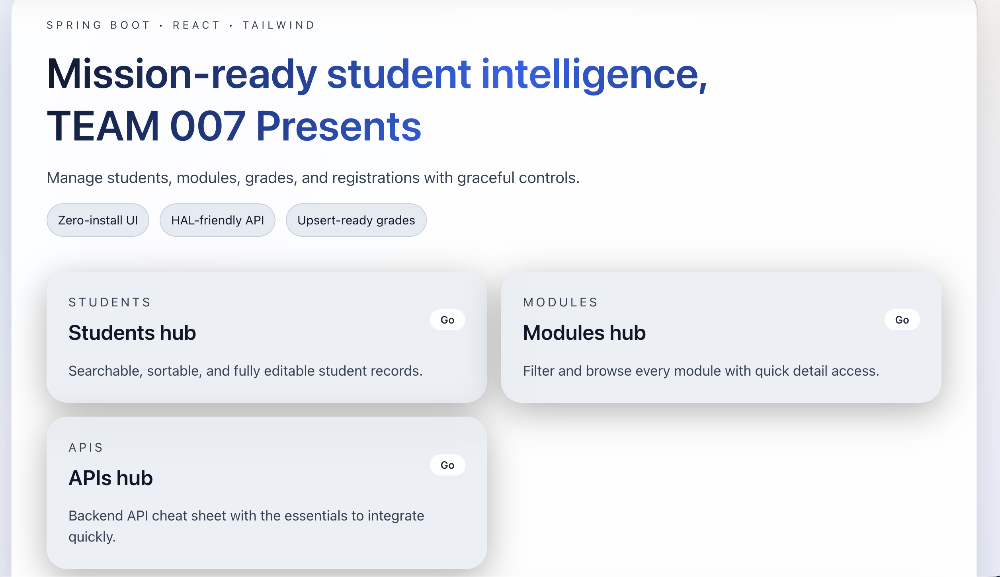

# COMP0010 Student Management Centre

Spring-Boot && React && TailwindCss Web Application.

Presented by UCL COMP0010 **Team 007**. 



## Table of Contents
- [COMP0010 Student Management Centre](#comp0010-student-management-centre)
  - [Features](#features)
  - [Architecture](#architecture)
  - [Getting Started](#getting-started)
    - [Prerequisites](#prerequisites)
    - [Backend](#backend)
    - [Frontend](#frontend)
  - [API Documentation](#api-documentation)
  - [Testing](#testing)
  - [Project Layout](#project-layout)
  - [Contributing](#contributing)
  - [License](#license)

## Features
- **Ready To Deploy**: Reverse Proxy Enabled. Exposing frontend server leads to a simple production environment.
- **Student lifecycle management**: CRUD endpoints for students, modules, registrations, and grades, including GPA and average calculations.
- **Token authentication**: Register, log in, and validate bearer tokens before hitting protected endpoints.
- **Interactive docs**: OpenAPI/Swagger UI for exploring and trying out APIs during development.
- **Modern frontend**: Vite + React + Tailwind CSS client served from `src/main/resources/static/frontend` with SPA routing.
- **H2 development database**: In-memory database with PostgreSQL compatibility for quick setup and reproducible runs.
- **Clean layering**: Controllers, services, repositories, and models are separated for maintainability and testing.

## Architecture
- **Backend**: Java 17, Spring Boot, Spring Web, and Spring Security. Authentication is handled via bearer tokens injected by `AuthTokenFilter`, with global exception handling through `ApiExceptionHandler`.
- **Persistence**: Spring Data JPA backed by an in-memory H2 database (console available at `/h2-console`).
- **Frontend**: React application built with Vite and Tailwind CSS; assets are bundled into `src/main/resources/static` for production hosting by Spring Boot.

## Getting Started
### Prerequisites
- Java 17+
- Maven 3.9+
- Node.js 18+ and npm (for frontend development)

Clone and enter the project directory:
```bash
git clone https://github.com/ucl-comp0010-2025-classroom/coursework-d-25-t2-s-25-ap1-java_007.git
cd comp0010_spring_app
```

### Backend
Start the API server on port **2800**:
```bash
mvn spring-boot:run
```
The service will be reachable at `http://localhost:2800`.

### Frontend
Run the React dev server on port **5173**:
```bash
cd src/main/resources/static/frontend
npm install
npm run dev
```
For production builds (served by Spring Boot), compile the static assets:
```bash
npm run build
```

## API Documentation
Interactive OpenAPI docs are available once the backend is running:
```
http://localhost:2800/swagger-ui/index.html
```
Most write operations require an `Authorization: Bearer <token>` header. Use `/api/auth/register` and `/api/auth/login` to obtain tokens.

## Testing
Run the full backend test and quality suite:
```bash
mvn compile test checkstyle:check spotbugs:check verify site
```

## Project Layout
```
src/main/java/uk/ac/ucl/comp0010/
├─ controllers/   # REST endpoints (auth, students, modules, grades, registrations)
├─ services/      # Business logic and orchestration
├─ repositories/  # Spring Data JPA repositories
├─ models/        # JPA entities (Student, Module, Registration, Grade, UserAccount)
├─ config/        # Security, web configuration, and request filtering
└─ Group007Application.java  # Application entry point
src/main/resources/
├─ application.properties    # Server/database/doc configuration
└─ static/frontend/          # Vite + React application
```

## Contributing
Pull requests are welcome! Please keep changes scoped, add tests where meaningful, and run the verification suite before submitting.

## License
This project is released for academic purposes. Adapt or extend as needed for your coursework or learning projects.
