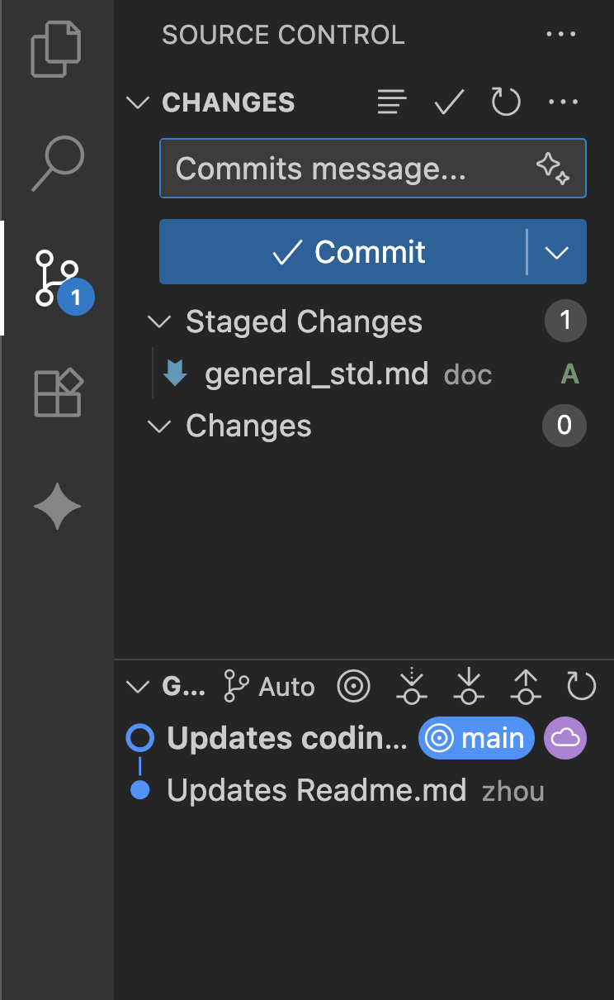

# General Standard.

Some more useful standards. We better not type mandarin so I will use simple English...

## Infra

I could provide a Google Cloud Computing Engine if we are gonna deploy it. And some other infra that I am familiar with:

- Caddy (No Nginx)
- Docker
- Some Free Domain

## Git

Use VSCode built-in Git support to commit/push/solve conflict.

Use Http if you are not familiar with ssh. (However, you are gonna need ssh when deploying it.)

- Don't commit all your code at once. Think about what have you done on each file and commit them separately.

- Commit message must start with a verb (E.g. Commits, Updates, Creates...)

- Check your changes before any commit. (E.g. I've once pissed up my mentor through commiting a space.)
  

Use Git CLI to control version.

1.  Head back to last n commit.

    git reset --hard HEAD~n
    git reset --hard HEAD~1
    ...

2.  Create your own branch.

    git checkout -b your-branch

3.  Pull updates from other branch.

    git checkout origin/your-branch
    git fetch origin
    git merge origin/target-pull-branch

Manage your .gitignore. Here are some useful rules.

- .cache
- build
- \*.env

## Formatter

For consistency of code style, we better use a formatter. 
-   VSCode: Red Hat Java Support provides a default formatter. ".vscode" file includes the configuration so don't you guys using vscode worry about it.
-   IntelliJ: Built-in Formatter should work well.

## Editor

For VSCode, press alt+z or option+z to enable "visual new line". This is **super important**. The "real new line" is managed by formatter and we are gonna keep it consistent.

For IntelliJ, this is not default hotkey. But you can right‑click on the blank area to the right of the line numbers, as shown in the figure. Then check Soft‑Wrap, and the script will automatically wrap lines
